# Developer Guide for Budget Buddy

## Table of Contents
[1. Introduction](#1-introduction)  
[2. Setting up](#2-setup-guide)  
&nbsp;&nbsp;[2.1 Prerequisites](#21-prerequisites)  
&nbsp;&nbsp;[2.2 Setting up the project](#2)  
&nbsp;&nbsp;[2.3 Verify the setup](#2)  
[3. Design](#3design)  
&nbsp;&nbsp;[3.1 Architecture](#31-architecture)  
&nbsp;&nbsp;[3.2 Parser Class](#32-parser-class)  
&nbsp;&nbsp;[3.3 Ui Class](#33-ui-class) 
&nbsp;&nbsp;[3.4 CommandCreator](#35-commandcreator-class)  
&nbsp;&nbsp;[3.5 CommandClass](#34-command-class) 
&nbsp;&nbsp;[3.6 Storage Class]() 
&nbsp;&nbsp;[3.7 Commons]() 
&nbsp;&nbsp;&nbsp;&nbsp;[3.7.1 Transaction]() 
&nbsp;&nbsp;&nbsp;&nbsp;[3.7.2 Expense]() 
&nbsp;&nbsp;&nbsp;&nbsp;[3.7.3 ExpenseList]() 
&nbsp;&nbsp;&nbsp;&nbsp;[3.7.4 Saving]() 
&nbsp;&nbsp;&nbsp;&nbsp;[3.7.5 SavingList]() 
&nbsp;&nbsp;&nbsp;&nbsp;[3.7.6 RecurringExpenseList]() 
&nbsp;&nbsp;&nbsp;&nbsp;[3.7.7 RecurringExpensesList]()  
&nbsp;&nbsp;&nbsp;&nbsp;[3.7.8 DefaultCurrency]() 
&nbsp;&nbsp;&nbsp;&nbsp;[3.7.9 CurrencyConverter]() 
[4. Implementation](#4-implementation)  
&nbsp;&nbsp;[4.1 Menu Feature]()  
&nbsp;&nbsp;[4.2 Add Expenses Feature]()  
&nbsp;&nbsp;[4.3 Add Savings Feature]()  
&nbsp;&nbsp;[4.4 Add Split Expenses Feature]()  
&nbsp;&nbsp;[4.5 Edit Savings Feature]()  
&nbsp;&nbsp;[4.6 Edit Expenses Feature]()  
&nbsp;&nbsp;[4.7 Reduce Savings Feature]()  
&nbsp;&nbsp;[4.8 Delete Expenses Feature]()  
&nbsp;&nbsp;[4.9 List Savings Feature]()  
&nbsp;&nbsp;[4.10 List Expenses Feature]()  
&nbsp;&nbsp;[4.3 Check Splitted Expenses Feature]()  
&nbsp;&nbsp;[4.3 Settle Splitted Expenses Feature]()  
&nbsp;&nbsp;[4.13 Find Expenses Feature]()  
&nbsp;&nbsp;[4.3 Check Splitted Expenses Feature]()  
&nbsp;&nbsp;[4.3 Currency Converter Feature]()  
&nbsp;&nbsp;[4.25 Get Graphical Insights for expenses]()  
&nbsp;&nbsp;[4.26 Get Graphical Insights for savings]()  
[5. Documentation]()  
[6. Testing]()  
[Appendix A: Product Scope](#5-product-scope)  
[Appendix B: User Stories](#6-user-stories)  
[Appendix C: Use Cases]()  
[Appendix D: Non-Functional Requirements](#non-functional-requirements)  
[Appendix E: Glossary]()  
[Appendix F: Instructions for Manual Testing](#instructions-for-manual-testing)  

## Acknowledgements

Diagrams have been created on [Draw.io](https://draw.io/).

## Design & implementation

## 1. Introduction
Welcome to the Developer Guide for BudgetBuddy! This guide has been created to help you current and future 
developers of Budget understand how BudgetBuddy works and aid developers in easily adding new features, 
fix bugs. In this guide, it will go over the main parts of the app, how they work together, 
and why we made them that way.

## 2. Setup Guide
This section describes how to set up the coding environment, along with the tools needed to work on BudgetBuddy

### 2.1. Prerequisites
1. JDK 11
2. IntelliJ IDEA

## 3.Design

### 3.1 Architecture
The following diagram provides a rough overview of how BudgetBuddy is built

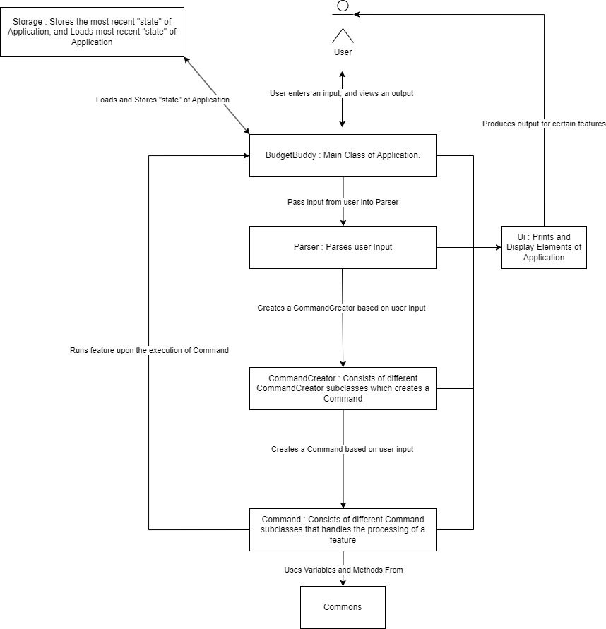

`BudgetBuddy` is the main class of the application and directly interacts with the user. `BudgetBuddy` 
passes along the input into the `Parser`. The `Parser` creates a `CommandCreator` object depending on the user's input
. The `CommandCreator` object then creates the `Command` object. 
This `Command` object will be executed in `BudgetBuddy`. The `Command` object 
utilizes methods and the classes present in `Commons`, which will be explained in more 
detail in the following sections.

#### 3.2 Parser Class
The main functionality of the Parser Class is to determine the type of `CommandCreator` object to create. Using
Boolean Functions, the Parser Class determines this by what the user input starts with. 
After determining the type of `CommandCreator` object, the Parser initializes the `CommandCreator` object
with all its required parameters. 

Here are some examples :

| Boolean Method        | Checks if input starts with | Feature Requires   | Creates                                    |
|-----------------------|-----------------------------|--------------------|--------------------------------------------|
| isAddExpenseCommand() | add expense                 | input, ExpenseList | AddExpenseCommandCreator(input, expenses)  |
| isEditSavingCommand() | edit expense                | input, SavingList  | EditSavingsCommandCreator(input, savings)  |

#### 3.3 Ui Class
The Ui Class is used to print certain elements to the CLI. In particular, it consists of the Welcome Message,
Goodbye Message, Divider Lines and all the corresponding commands' command format.

#### 3.4 CommandCreator Class
The CommandCreator class has multiple subclasses, which corresponds to a specific function of the application.
Within the CommandCreator classes, it handles making sense of the user input, obtaining the relevant parameters, and finally
creating the `Command` class to be executed.

The superclass `CommandCreator` is an abstract class which is never instantiated. Where its `createCommand()` 
method is overridden by its subclasses.

The association between the `Command` and `CommandCreator` can be seen in their names. E.g. `MenuCommandCreator`, would
create a `MenuCommand` class when its createCommand() method is called. Similarly, `FindExpensesCommandCreator` would
create a `FindCommand` class when its createCommand() method is called.

For clarity, unlike the `BudgetBuddy` and `Parser` class, where only **one** instance of them is used for the entire
application, a **new** `CommandCreator` subclass is instantiated every time a user provides an input. Hence,
a created `CommandCreator` will always be specific to, and only handle `one` user input. This will be further illustrated in the
UML Sequence Diagram provided in section `3.4 Command Class`

#### 3.5 Command Class
The Command class, similar to the CommandCreator class, contains multiple subclasses, all corresponding to a specific
function/feature of the application. Stated in section`3.5 CommandCreator Class`
, each subclass of the `Command` Object is created by its associated `CommandCreator`. 

The superclass `Command` is an abstract class which is never instantiated. Where its `execute()` method is overridden
by its subclasses. What each Command subclass does when its `execute()` method is called would be discussed in 
more detail in the Implementation section.

For clarity, similar to the `CommandCreator` class, a **new** `Command` subclass is instantiated every time a
user provides an input. As such, a created `Command` will always be specific to, and only handle `one` user input.

The following UML Sequence Diagram depicts the process of what happens
when a user input is passed through the application, up till the point when the command gets executed :

**Note** : BudgetBuddy instantiates other classes such as the Storage and Ui class, however, 
these steps have been left out as they have no relevance to the process of creating and executing a Command.

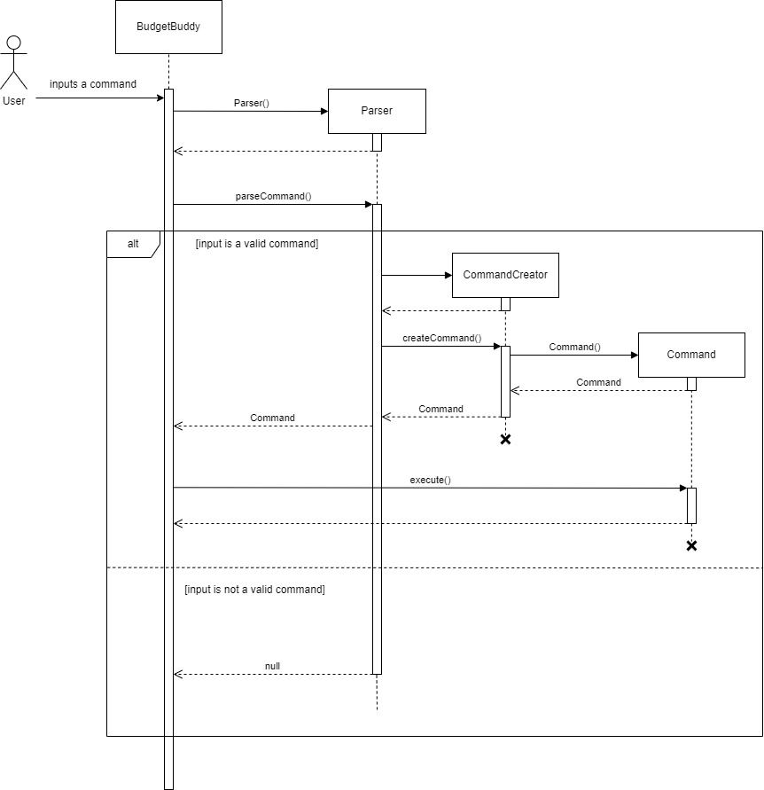

#### 3.6 Storage Class
The Storage Class handles the loading and saving of the features in BudgetBuddy. Different features are saved in
different files corresponding to their data type.

The **Storing** methods are always called after every `user input`, ensuring that the saved files 
are always up-to-date.

Similarly, the **Loading** methods present in the Storage Class is always called **before** the application is fully
initialized.

### 3.7 Commons
The classes present in this group of `Commons` refers to a collection of classes used by multiple other components
. They represent data of the user's financial transactions, including expenses and savings, along with methods 
for organizing and managing this data.

##### 3.7.1 Transaction
This is an abstract class, which is the superclass for both the Expense and Saving Classes. It contains common variables
such as Currency, Category and Amount.

<!-- @@author sweijie24-->
##### 3.7.2 Expense
This class holds details regarding an expense a user has. Within this class, it has 4 class-level variables :
`String category`, `LocalDate dateAdded` , `String description` and `Double amount`.

`String category` : This variable holds the category of the expense. It represents the type or classification 
of the expense as per the pre-defined categories ("Housing", "Groceries", "Utility", "Transport", "Entertainment").

`LocalDate dateAdded` : This variable holds the date when the expense was added or recorded. 
It is of type LocalDate, representing a date without a time zone. 
Storing the date of the expense allows users to track when each expense occurred, 
facilitating budget management and analysis over time.

`String description` : This variable holds a description of the expense. 
It provides additional details or information about the expense, 
such as what the expense was for or any relevant notes. 
Descriptions help users understand the context or purpose of each expense entry.

`Double amount` :  This variable holds the monetary amount of the expense. 
It represents the cost or value of the expense, typically in the currency used by the user. 
Storing the amount allows users to track how much money was spent on each expense, 
aiding in budgeting and financial planning.

<!-- @@author sweijie24-->
##### 3.7.3 ExpenseList
This class represents a list of expenses. Within this class, it has 2 class-level variables :
`ArrayList<Expense> expenses` and `ArrayList<String> categories`, The variables and there relevance are as follows :

`ArrayList<Expense> expenses` : This variable holds a list of `Expense` objects. 
Each `Expense` object represents an expense incurred by the user. The list stores all the expenses entered by the user. 
Managing expenses in a list allows for easy retrieval, modification, and deletion of individual expenses. 
Additionally, it enables functionalities such as filtering, listing, and calculating total expenses.

`ArrayList<String> categories` : This variable holds a list of predefined expense categories. 
Each category represents a classification or grouping for expenses, such as "Housing," "Groceries," "Utility," etc. 
The list provides predefined options for users to select when adding or editing expenses. 
It helps organize expenses into meaningful groups, 
allowing users to track and analyze their spending habits across different expense categories.

This class also contains the methods to handle any user interactions with the list of expenses. These methods would
be further explained in their corresponding `Implementation` sections.

<!-- @@author sweijie24-->
##### 3.7.4 Saving
This class holds details regarding a saving a user has. Within this class, it has 3 class-level variables :
`String category`, `LocalDate dateAdded`, `Double amount`. The variables and their relevance
are as follows :

`String Category` : This variable holds the category of the saving. 
Similar to expenses, savings can also be categorized based on their purpose or intended use. 
Pre-defined categories include ("Salary", "Investments", "Gifts", or "Others"). 
Categorizing savings helps users allocate funds for different financial goals and track progress towards those goals.

`LocalDate dateAdded` : This variable holds the date when the saving was added or recorded. 
As with expenses, tracking the date of each saving allows users to monitor their saving habits over time. 
It provides a historical record of when savings were initiated, 
helping users understand their saving patterns and behaviors.

`Double amount` : This variable holds the monetary amount of the saving. 
It represents the value or sum of money saved by the user. 
The amount indicates how much money has been set aside or accumulated towards achieving a particular financial goal. 
Users can track their progress towards savings targets and 
monitor their overall financial health based on the amount saved.

<!-- @@author sweijie24-->
##### 3.7.5 SavingList
This class represents a list of savings. Within this class, it has 2 class-level variables :
`ArrayList<Saving> savings` and `ArrayList<String> categories`, The variables and there relevance are as follows :

`ArrayList<Saving> savings`: This variable holds a list of `Saving` objects, 
where each object represents a saving made by the user. The list stores all the savings entered by the user. 
Managing savings in a list allows for easy retrieval, modification, and reduction of individual savings. 
Additionally, it enables functionalities such as listing savings, calculating remaining savings after 
deducting expenses, and adding new savings.

`ArrayList<String> categories`: This variable holds a list of predefined saving categories. 
Each category represents a classification or grouping for savings, such as "Salary," "Investments," "Gifts," etc. 
The list provides predefined options for users to select when adding or editing savings. 
It helps organize savings into meaningful groups, allowing users to track and 
manage their savings across different categories.

This class also contains the methods to handle any user interactions with the list of savings. These methods would
be further explained in their corresponding `Implementation` sections.

##### 3.7.6 RecurringExpenseList
This class represents a list of recurring expenses for the Recurring Expense feature. Within this class, it has 
1 class-level variable : `String name`. Which is used to store the name of the list. Given that its overall 
functionality is similar to ExpenseList class, it **inherits** the ExpenseList class.

##### 3.7.7 RecurringExpenseLists
This class represents the list of all lists of recurring expenses for the Recurring Expense feature. Within this class,
it has only 1 class-level variable : `ArrayList<ExpenseList> recurringExpenses`. Which is used to store a list of
ExpenseList objects. This class contains all methods required for the overall Recurring Expense feature to work. 
The implementation of these methods would be discussed in further detail in the **Implementation** section.

For clarity, the following Class Diagram depicts the associations between RecurringExpenseLists, RecurringExpenseList and
ExpenseList.

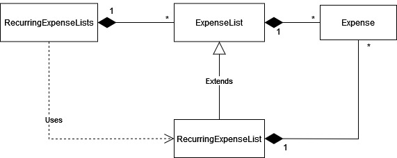

<!-- @@author sweijie24-->
##### 3.7.8 DefaultCurrency
The `DefaultCurrency` class manages the application's default currency setting. It contains a static variable:

- `Currency defaultCurrency`: Holds the current default currency setting, initialized to the Singapore Dollar (SGD) using the `Currency.getInstance("SGD")` method.

This class provides two static methods that are further explained in detail in the **Implementation** section.  
This class ensures a consistent default currency is used throughout the application, essential for functions like displaying amounts and performing currency conversions.

<!-- @@author sweijie24-->
##### 3.7.9 CurrencyConverter
The `CurrencyConverter` class provides functionality for converting amounts between different currencies. It includes two class-level variables:

`Map<Currency, Double> exchangeRates`: This variable represents a map where the keys are instances of 
the `Currency` class, and the values are conversion rates as `Double` values. 
The map stores exchange rates for various currencies relative to a base currency (in this case, Singapore Dollar, SGD). 
The exchange rates are initialized with default values for common currencies such as 
USD, EUR, JPY, KRW, MYR, CNY, and HKD.

The class includes several methods to handle currency conversion tasks, with its relevance explained in the **Implementation** section.  

* `convertBudgetCurrency(Currency newCurrency, ExpenseList expenseList)`:
This method is responsible for converting the currency of all budgets within `ExpenseList` to a specified new currency (`newCurrency`). It 
accepts the new `Currency` object representing the target currency and the `ExpenseList` containing the budgets, and updates
the budget amounts and currencies accordingly.

These methods facilitate currency conversion tasks by handling the conversion logic, validating input parameters, 
and logging relevant messages. They provide essential functionality for managing expenses and savings in different 
currencies within the budget management application.

## 4. Implementation

<!-- @@author itsmejr257-->
### 4.1 Menu Feature

The menu feature is designed to allow users to view the relevant command formats by inputting the relevant menu
indexes. This feature is orchestrated by the `MenuCommand` class, which is initialized by the `MenuCommandCreator`
class. Which is in turn, created by the `Parser` class. Within the `MenuCommand` object, the
`MenuCommandCreator` would initialize one class-level variable `index` of type `String`. The relevance of
this class-level variable in `MenuCommand` is as follows

| Variable Name | Variable Type | Relevance                                              |
|---------------|---------------|--------------------------------------------------------|
| index         | int           | Refers to the corresponding item in the displayed menu |

For Clarity, the menu items and their corresponding indexes are as follows :

| index   | Menu Item               |
|---------|-------------------------|
| Empty/0 | Displays all Menu Items |
| 1       | Manage Expenses         |
| 2       | Manage Savings          |
| 3       | View Expenses           |
| 4       | View Savings            |
| 5       | Find Expenses           |
| 6       | Split Expenses          |
| 7       | Manage Recurring Bills  |
| 8       | Change Currency         |
| 9       | Manage Budget           |
| 10      | Get Graphical Insights  | 

Upon the call of the `execute()` method in BudgetBuddy using `command.execute()`, the `MenuCommand` object
utilizes methods from the `UI` class to display the relevant menu items. The utilized methods are as follows :

| methodName          | Return Type | Relevance                           |
|---------------------|-------------|-------------------------------------|
| showMenuTitles()    | void        | Prints all Menu Items               |
| showMenuItem(INDEX) | void        | Prints commands associated at INDEX |

**Important Note** : As the process of how the CommandCreator is created upon the receipt of a user input has already been
discussed in `3.4 CommandClass`, the following Sequence Diagrams would omit the initial methods prior to the
MenuCommandCreator being created.

The following UML Sequence Diagram shows how the MenuCommandCreator for Menu Commands work and what
will be returned to the Parser, which will ultimately be returned to BudgetBuddy.  Note that this diagram assumes that `Parser`
has already detected that the user input is a menu command and has initialized a MenuCommandCreator object:

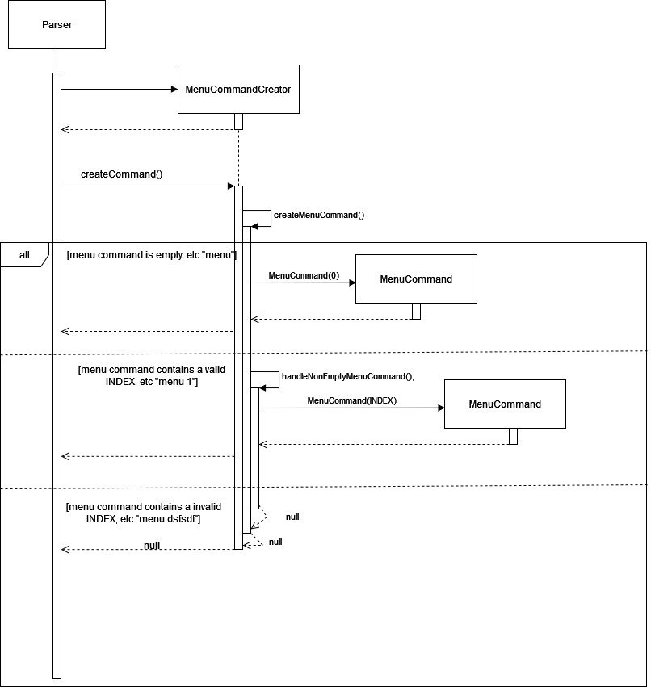

The following UML Sequence Diagram shows the processes of the MenuCommand upon the call of its execute() command:
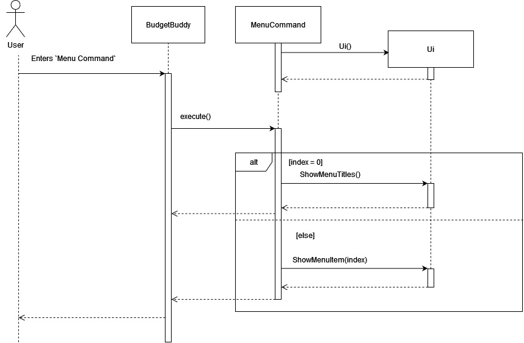

Given below is an example usage scenario and how the full Menu feature works :
1. The user types `menu 1`. This input passed from `BudgetBuddy` into `Parser#parseCommands()`.
2. Within the `Parser` , it determines that the input is a menu command from `isMenuCommand()`, and creates a new
   `MenuCommandCreator` object.
3. The `Parser` then calls `MenuCommandCreator#createCommand()`
4. The checks for whether the input is valid, in particular whether it is a valid integer,
   along with obtaining the value of `index` is done in `MenuCommandCreator#handleMenuCommand()`
5. `MenuCommandCreator` creates a constructor for `MenuCommand` with the parameter `1`, which in turn
   also constructs a new `Ui` object
6. `MenuCommandCreator` returns this created `MenuCommand` to `Parser`, which is then returned to `BudgetBuddy`
7. `BudgetBuddy` then calls `MenuCommand#execute()`
8. `execute()` then calls `Ui#showMenuItem(1)`
9. `showMenuItem()` in `Ui` then prints all commands for `case 1` which is for `Manage Expenses`

### Add Expense Feature

The Add Expense Feature allows users to add expenses to different categories. `AddExpenseCommand` class enables this feature, 
after initialized by the `Parser` class. Within the `AddExpense` object, the `Parser` would have initialized it with
4 variables, an `ExpenseList` object,  along with a `category`, `amount` , `description`. 
The relevance of these Class Attributes in `AddExpenseCommand` is as follows : 

| Class Attribute | Variable Type | Relevance                                         |
|-----------------|---------------|---------------------------------------------------|
| expenses        | ExpenseList   | ExpenseList Object containing the list of expenses|
| category        | String        | The category that the `expense` belongs to        |
| amount          | String        | The amount spent                                  |
| description     | String        | The description of the expense                    |

Upon the call of the `execute()` method in `BudgetBuddy` using `command.execute()`,
the `AddExpenseCommand` Object utilizes the following method from the `ExpenseList` class to add it to the existing
list of `expenses` matching against the corresponding `category`.

| Method       | Return Type | Relevance                                       |
|--------------|-------------|-------------------------------------------------|
| addExpense() | void        | Add expense to the existing list of `expenses`  |

The following UML Sequence diagram shows how the Parser works to obtain the relevant inputs for the Add Expense Feature :

The following is a step-by-step explanation for the Parser for the Find Feature :
1. `BudgetBuddy` calls `Parser#parseCommand(input)` with `input` being the entire user input.
E.g `add expense c/Transport a/20 d/EZ-Link Top Up`
2. Within the `Parser`, it will have determined that the `input` is a Find Command from the `isAddExpenseCommand(input)`
function. 
3. The `Parser` then self calls the method `handleAddExpenseCommand(input)` with the `input` still being the entire
user input.
4. Within `AddExpenseCommand(input)`, the first check would be the check for the existence of any combination of 
`c/ , a/ and d/`. If none of these combinations were found, it immediately returns `null`. 
5. If the checks in `4.` is passed, Three variables would be initialized.

    * | Variable Name | Variable Type |                                                              
      |---------------|---------------|
      | category      | String        | 
      | amount     | String        |
      | description   | String        |
6. Depending on which parameters were present, the corresponding input would be extracted and placed into each variable
using the `Parser#extractDetailsForAdd(input, "parameter")`
7. Finally, `Parser#handleAddExpenseCommand()` returns a `AddExpensesCommand` to `Parser#parseCommand()`, which is
then returned to `BudgetBuddy`

### Add Savings Feature

The Add Savings Feature allows users to add savings to different categories. `AddSavingCommandCreator` class intialises the `AddSavingCommand`, after initialised by the `Parser` class. Within the `AddSavings` object, the `Parser` would have initialized it with
4 variables, a `SavingList` object,  along with a `category`, `amount`. 
The relevance of these Class Attributes in `AddExpenseCommand` is as follows : 

| Class Attribute | Variable Type | Relevance                                         |
|-----------------|---------------|---------------------------------------------------|
| savings         | SavingList    | SavingList Object containing the list of savings  |
| category        | String        | The category that the `expense` belongs to        |
| amount          | String        | The amount spent                                  |

Upon the call of the `execute()` method in `BudgetBuddy` using `command.execute()`,
the `AddSavingCommand` Object utilizes the following method from the `SavingList` class to add it to the existing
list of `savings` matching against the corresponding `category`.

| Method       | Return Type | Relevance                                       |
|--------------|-------------|-------------------------------------------------|
| addSaving()  | void        | Add savings to the existing list of `savings`   |

The following UML Sequence diagram shows how the Parser works to obtain the relevant inputs for the Add Expense Feature :

The following is a step-by-step explanation for the Parser for the Find Feature :
1. `BudgetBuddy` calls `Parser#parseCommand(input)` with `input` being the entire user input.
E.g `add savings c/Allowance a/20`
2. Within the `Parser`, it will have determined that the `input` is a Find Command from the `isAddSavingsCommand(input)`
function. 
3. The `Parser` then self calls the method `handleAddExpenseCommand(input)` with the `input` still being the entire
user input.
4. Within `AddExpenseCommand(input)`, the first check would be the check for the existence of any combination of 
`c/ , and a/`. If none of these combinations were found, it immediately returns `null`. 
5. If the checks in `4.` is passed, two variables would be initialized.

    * | Variable Name | Variable Type |                                                              
      |---------------|---------------|
      | category      | String        | 
      | amount        | String        |
6. Depending on which parameters were present, the corresponding input would be extracted and placed into each variable
using the `Parser#extractDetailsForAdd(input, "parameter")`
7. Finally, `Parser#handleAddExpenseCommand()` intialises a `AddExpensesCommandCreator` which then returns `AddSavingCommand` to `Parser#parseCommand()`, which is then returned to `BudgetBuddy`.

<!-- @@author jasraa-->
### 4.5 Edit Savings Feature
The Edit Savings feature allows users to update their previously saved financial contributions, specifically adjusting
the `category` and `amount`. This feature is facilitated by the `EditSavingCommand` class, which is prepared and issued
by the `Parser` class. An `EditSavingCommand` object encapsulates several variables that are instantiated within the
`Parser`: a `SavingList` object, `category`, `index`, and `amount`. The significance of these Class Attributes within
`EditSavingCommand` is detailed below:

| Class Attribute | Variable Type | Relevance                                                             |
|-----------------|---------------|-----------------------------------------------------------------------|
| savings         | SavingList    | SavingList Object containing the list of savings that can be modified |
| category        | String        | The updated category for the saving entry at the specified index      |
| index           | Integer       | The index of the saving entry to be updated within `SavingList`       |
| amount          | Double        | The updated monetary value for the saving entry at the specified index|

Upon invoking the `execute()` method in `BudgetBuddy` through `command.execute()`, the `EditSavingCommand` object
leverages the following method from the `SavingList` class to carry out the modification:

| Method       | Return Type | Relevance                                                                                   |
|--------------|-------------|---------------------------------------------------------------------------------------------|
| editSaving() | void        | Adjusts the `category` and `amount` for the saving entry at the provided `index`            |

The following UML Sequence diagram illustrates the execution process of the Edit Savings Feature Command when a user enters a valid edit savings command:

Here is a step-by-step narrative of the actions taken for a sample input:
`edit savings c/Salary i/1 a/3000`

1. BudgetBuddy receives the command `edit savings c/Salary i/1 a/3000` and passes it to the `Parser` for interpretation.
2. The `Parser` splits the command into components and constructs an `EditSavingCommand` object with the category (`c/Salary`), index (`i/1`), and amount (`a/3000`).
3. The `Parser` returns the constructed `EditSavingCommand` object to BudgetBuddy.
4. BudgetBuddy then executes the `execute()` method on the `EditSavingCommand` object.
5. Inside its `execute()` method, `EditSavingCommand` calls the `editSaving` method of `SavingList`, supplying the relevant parameters.
6. `SavingList` locates the first saving entry in its array (adjusting for zero-based indexing with index - 1) and updates the entry's category to "Salary" and the amount to 3000.0.
7. Finally, the console outputs a confirmation message: "Saving updated successfully."

<!-- @@author jasraa-->
### 4.6 Edit Expense Feature
The Edit Expense feature allows users to edit their previously added expenses, specifically the `category`, `amount`, 
and `description`. This feature is managed by the `EditExpenseCommand` class, which is initialized by the 
`Parser` class. Within the `EditExpenseCommand` object, 5 variables would have been initialized in the `Parser` class:
an `ExpenseList` object, `category`, `index`, `amount` and `description`. The relevance of these Class Attributes in 
`EditExpenseCommand` is as follows:

| Class Attribute | Variable Type | Relevance                                                             |
|-----------------|---------------|-----------------------------------------------------------------------|
| expenses        | ExpenseList   | ExpenseList Object containing the list of expenses that can be edited |
| category        | String        | The edited category for the expense in the specified index            |
| index           | Integer       | The index of the expense to be edited from `ExpenseList`              |
| amount          | Double        | The edited amount the expense in the specified index should be        |
| description     | String        | The edited description for the expense in the specified index         |

When the `execute()` method in `BudgetBuddy` is called via `command.execute()`, the `EditExpenseCommand` Object, 
utilizes the following method from the `ExpenseList` class to edit the expense.

| Method        | Return Type | Relevance                                                                                 |
|---------------|-------------|-------------------------------------------------------------------------------------------|
| editExpense() | void        | Edits the `category`, `amount` and `description` for the expense in the specified `index` |

The following UML Sequence diagram below shows how the Edit Expense Feature Command is executed when a user
inputs a valid edit expense command:

The following is a step by step explanation of the processes that occur for an example input:
`edit expense c/Transport i/2 a/40 d/GRAB`

1. The BudgetBuddy application receives the input string `edit expense c/Transport i/2 a/40 d/GRAB` and uses 
the `Parser` to interpret it.
2. The `Parser` splits the input into parts and constructs a `EditExpenseCommand` Object with the category 
(`c/Transport`), index (`i/2`), 
amount (`a/40`), and description (`d/GRAB`).
3. `Parser` returns this called `EditExpenseCommand` Object to `BudgetBuddy`.
4. The `BudgetBuddy` application calls `execute()` on the `EditExpenseCommand` object.
5. The `EditExpenseCommand` object calls `editExpense` on the `ExpenseList` with the provided parameters. 
6. The `ExpenseList` looks up the second expense in its list 
(as lists are zero-indexed, it uses index - 1 to access the correct item), and updates this expense’s 
category to "Transport," amount to 40.0, and description to "GRAB."
7. A message "Expense edited successfully." is printed to the console.

### 4.6 Reduce Savings Feature
The Reduce Savings feature enables users to decrement a specified amount from their savings at a given index. This 
functionality is controlled by the `ReduceSavingCommand` class, which is produced by the `ReduceSavingCommandCreator` 
based on user input. The `ReduceSavingCommand` class uses a `SavingList` object to access the relevant saving and performs 
the reduction operation using the provided index and amount. Below is the relevance of these attributes:

| Class Attribute | Variable Type | Relevance                                                                    |
|-----------------|---------------|------------------------------------------------------------------------------|
| savings         | SavingList    | The `SavingList` object containing the list of savings which can be reduced  |
| category        | String        | TThe category of savings to reduce                                           |
| amount          | double        | The amount by which the savings in the specified category should be reduced  |

When `BudgetBuddy` runs the `execute()` method through `command.execute()`, the `ReduceSavingCommand` leverages the reduceSavingsByCategory method from the `SavingList` class:

| Method                      | Return Type | Relevance                                                        |
|-----------------------------|-------------|------------------------------------------------------------------|
| reduceSavingsByCategory()   | void        | Decreases the savings by a specified amount in a given category  |

The user interaction for reducing savings follows these steps:

1. The user commands to reduce savings by inputting `reduce savings c/[category] a/[amount]`.
2. `BudgetBuddy` processes this input with the help of a `Parser`, which identifies the suitable `CommandCreator`.
3. `Parser` constructs a `ReduceSavingCommand` object with the extracted category and amount.
4. `BudgetBuddy` then executes the `ReduceSavingCommand`.
5. The `execute()` method within ReduceSavingCommand calls the SavingList's reduceSavingsByCategory function.
6. The `reduceSavingsByCategory` method performs the deduction and updates the savings amount.

The following UML Sequence diagram below shows how the Reduce savings Feature Command is executed when a user
inputs a valid reduce savings command:

### 4.7 Delete Expenses Feature
The Delete Expense feature grants users the capability to remove expenses they have previously entered. Managed by the 
DeleteExpenseCommand class, this feature is initialized through DeleteExpenseCommandCreator. During the creation process, 
the command is provided with an `ExpenseList` object and an `index` indicating the specific expense to be deleted. 
The following table outlines the significance of these attributes:

| Class Attribute | Variable Type | Relevance                                                             |
|-----------------|---------------|-----------------------------------------------------------------------|
| expenses        | ExpenseList   | ExpenseList Object containing the list of expenses that can be edited |
| index           | Integer       |  The edited category for the expense in the specified index           |

On invocation of the `execute()` method, as part of the `command.execute() `flow within BudgetBuddy, the DeleteExpenseCommand 
object engages the deleteExpense() method from the ExpenseList class.

| Method                      | Return Type | Relevance                                                 |
|-----------------------------|-------------|-----------------------------------------------------------|
| deleteExpense()             | void        | Removes the expense at the specified index from the list  |

The user interaction for deleting expenses follows these steps:
1. The user submits a delete command in the format `delete expense i/index`, with `index` specifying the expense to be deleted.
2. `BudgetBuddy` receives the command and employs the Parser to deconstruct it.
3. The `Parser` discerns the delete command, extracting the index value and forming a DeleteExpenseCommand object.
4. `BudgetBuddy` triggers the DeleteExpenseCommand.execute() method. 
5. Inside `execute()`, the `deleteExpense()` method is called on `ExpenseList`, with `index` indicating the targeted expense. 
6. If the index is valid, the expense is removed, and a confirmation message is printed to the console.

<!-- @@author sweijie24-->
### Listing Feature (List Savings)

The Listing Savings Feature enables users to view their savings, potentially filtered by a specific category. This functionality is orchestrated by the `ListSavingsCommand` class, which is initialized by the `ListCommandCreator` class. Within the `ListSavingsCommand` object, the `ListCommandCreator` provides it with a `SavingList` object, an `ExpenseList` object, along with an optional `filterCategory`. The relevance of these class attributes in `ListSavingsCommand` is detailed in the following table:

| Class Attribute | Variable Type | Relevance                                                                            |
|-----------------|---------------|--------------------------------------------------------------------------------------|
| savings         | SavingList    | The `SavingList` object containing the list of savings to be displayed or filtered   |
| expenses        | ExpenseList   | The `ExpenseList` object containing the list of expenses                             |
| filterCategory  | String        | The category to filter the savings by, if provided                                   |

When `BudgetBuddy` invokes the `execute()` method via `command.execute()`, the `ListSavingsCommand` object uses several methods from the `SavingList` class to perform its tasks:

| Method                      | Return Type        | Relevance                                                      |
|-----------------------------|--------------------|----------------------------------------------------------------|
| getSavings()                | ArrayList<Saving>  | Retrieves the list of all savings from the `SavingList`        |
| findTotalSavings()          | void               | Calculates the total amount of savings stored in `SavingList`  |
| listSavings()               | void               | Prints the savings, filtered by `filterCategory`, to the CLI   |
| calculateRemainingSavings() | double             | Calculates the remaining amount after deducting total expenses |

The Listing Savings feature follows these steps when a user inputs a command to list savings:
1. The user inputs `list savings [optional: filterCategory]`. This input is processed by the `Parser` class in `BudgetBuddy`, which creates a `ListSavingsCommand` object with `savings` set to the current `SavingList` and `filterCategory` to the user-specified category, if any.
2. The `Parser` returns this `ListSavingsCommand` object to `BudgetBuddy`, which calls `ListSavingsCommand.execute()`.
3. `execute()` calls `SavingList.listSavings(filterCategory, expenses)`, where the `filterCategory` is applied if provided.
4. Within `listSavings()`, the `findTotalSavings()` method is called first to calculate the initial total savings amount.
5. The `listSavings()` method continues by iterating through each `Saving` and printing those that match the `filterCategory` criteria.
6. After listing, the method calculates and displays the remaining savings by calling `calculateRemainingSavings(initialAmount, totalExpenses)`, accounting for any expenses deducted.
7. If the `filterCategory` is not provided, all savings are printed, and the total initial amount and remaining savings after expenses are displayed.

#### Sequence Diagram
The UML Sequence diagram for the Listing Savings feature would illustrate the interactions between the `User`, `BudgetBuddy`, `Parser`, `ListSavingsCommand`, and `SavingList` classes, showing the method calls and returns between these objects to complete the operation.
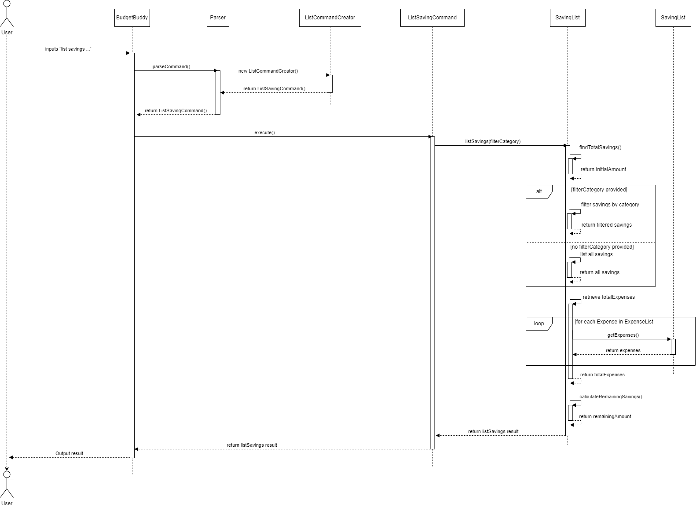

<!-- @@author sweijie24-->
### Listing Feature (List Expenses)
The Listing Expenses Feature provides users with the ability to view their expenses, which can be filtered by category. The `ListExpenseCommand` class, generated by the `ListCommandCreator`, is responsible for this feature. The class utilizes the `ExpenseList` object to access and manipulate expense records, optionally applying a filter based on the category. The significance of the `ListExpenseCommand` class's attributes is outlined below:

| Class Attribute | Variable Type | Relevance                                                                         |
|-----------------|---------------|-----------------------------------------------------------------------------------|
| expenses        | ExpenseList   | Holds the list of expenses to be filtered and listed                              |
| filterCategory  | String        | The category to filter the expenses by (null if no filtering is needed)           |

Upon invoking the `execute()` method by `BudgetBuddy` through `command.execute()`, the `ListExpenseCommand` object calls upon several methods from the `ExpenseList` class to carry out its responsibilities:

| Method                   | Return Type | Relevance                                                              |
|--------------------------|-------------|------------------------------------------------------------------------|
| listExpenses()           | void        | Prints the expenses, filtered by `filterCategory`, to the command line |
| calculateTotalExpenses() | double      | Calculates the total expenses from the list of expenses                |

Here's an overview of the process flow when a user employs the Listing Expenses feature:
1. The user types `list expenses [optional: filterCategory]`. This command is parsed by the `Parser` class within `BudgetBuddy`, which then creates a `ListExpenseCommand` with `expenses` set to the current `ExpenseList` and `filterCategory` set to any specified by the user.
2. The `Parser` returns the `ListExpenseCommand` object to `BudgetBuddy`, which calls `ListExpenseCommand.execute()`.
3. The `execute()` method invokes `ExpenseList.listExpenses(filterCategory)`. If a `filterCategory` is provided, it will filter the expenses accordingly.
4. The `listExpenses()` method in `ExpenseList` iterates over the list of expenses and prints each one that matches the filter category criteria or all expenses if no filter is provided.
5. The method concludes by displaying the total expenses calculated using `calculateTotalExpenses()`.

#### Sequence Diagram
The sequence diagram for the Listing Expenses feature would illustrate the above steps, showing the interactions between the `User`, `BudgetBuddy`, `Parser`, `ListExpensesCommand`, and `ExpenseList` classes.

<!-- @@author sweijie24-->
### Currency Converter Feature
The Currency Converter Feature allows users to convert the currency of expenses and savings. This feature is facilitated by the `ChangeCurrencyCommand` class, initialized by the `Parser` class with `CurrencyConverter`, `ExpenseList`, and `SavingList` objects, alongside the `newCurrency` to convert to. The importance of these class attributes is as follows:

| Class Attribute   | Variable Type          | Relevance                                                   |
|-------------------|------------------------|-------------------------------------------------------------|
| currencyConverter | CurrencyConverter      | The object responsible for currency conversion calculations |
| expenseList       | ExpenseList            | Contains the expenses whose currency will be converted      |
| savingList        | SavingList             | Contains the savings whose currency will be converted       |
| newCurrency       | Currency               | The new currency to which the amounts will be converted     | 
| exchangeRates     | Map<Currency, Double>  | Stores exchange rates with currencies as keys               |

When `BudgetBuddy` calls `command.execute()`, `ChangeCurrencyCommand` employs the following methods from `CurrencyConverter` to convert the currency of all financial records:

| Method                   | Return Type | Relevance                                                                |
|--------------------------|-------------|--------------------------------------------------------------------------|
| convertExpenseCurrency() | void        | Converts the currency of each `Expense` object to `newCurrency`          |
| convertSavingCurrency()  | void        | Converts the currency of each `Saving` object to `newCurrency`           |
| convertBudgetCurrency()  | void        | Converts the currency of each `Budget` object to `newCurrency`           |
| convertAmount()          | double      | Converts an amount from one currency to another using the exchange rates |

The Currency Converter feature also includes a mechanism for managing a default currency across the application, facilitated by the `DefaultCurrency` class. This enhancement allows for seamless conversion of financial records to a user-specified default currency.

* `convertAmount(double amount, Currency fromCurrency, Currency toCurrency)`:
  This method converts an amount from one currency to another using exchange rates stored in the `exchangeRates` map.
  It takes the original amount, the currency of the original amount (`fromCurrency`),
  and the target currency (`toCurrency`) as parameters and returns the converted amount.
  The method ensures that exchange rates are available for both currencies and that they are positive numbers.

* `convertExpenseCurrency(Currency newCurrency, ExpenseList expenses)`:
  This method converts the currency of expenses in a given `ExpenseList` to a specified new currency (`newCurrency`).
  It iterates through the expenses in the list, converts each expense amount to the new currency
  using the `convertAmount` method, and updates the expense amounts and currencies accordingly.

* `convertSavingCurrency(Currency newCurrency, SavingList savings)`: Similar to `convertExpenseCurrency`,
  this method converts the currency of savings in a given `SavingList` to a specified new currency (`newCurrency`).
  It iterates through the savings in the list, converts each saving amount to the new currency using the `convertAmount`
  method, and updates the saving amounts and currencies accordingly.

The `DefaultCurrency` class is designed to maintain and update the application-wide default currency setting. It provides static methods to get and set the default currency:

| Method               | Return Type | Relevance                                                    |
|----------------------|-------------|--------------------------------------------------------------|
| getDefaultCurrency   | Currency    | Retrieves the current default currency for the application   |
| setDefaultCurrency   | void        | Updates the default currency to a new value                  |

Here's the step-by-step process when the user uses the Currency Converter feature:
1. The user inputs `change currency [newCurrencyCode]`. `Parser` processes this input and constructs a `ChangeCurrencyCommand` object with the necessary attributes.
2. The `ChangeCurrencyCommand` object is returned to `BudgetBuddy`, which calls `ChangeCurrencyCommand.execute()`.
3. `execute()` invokes `CurrencyConverter.convertExpenseCurrency(newCurrency, expenseList)` and `CurrencyConverter.convertSavingCurrency(newCurrency, savingList)`.
4. Within the `convertExpenseCurrency` and `convertSavingCurrency` call, the amounts of `Expense`, `Saving` or `Budget` objects are converted to the `newCurrency` using the `convertAmount` method.
5. The `DefaultCurrency.setDefaultCurrency(newCurrency)` method is called to update the application's default currency setting to `newCurrency`.
6. The `setAmount` and `setCurrency` methods of `ExpenseList` and `SavingList` are used to update the amounts and currency codes.
7. After successful conversion of savings, expenses and budgets, the default currency of the application is updated, reflecting the new choice across BudgetBuddy.

#### Sequence Diagram

The sequence diagram would be segmented into the different features that utilises the CurrencyConverter class.

Main Sequence Diagram before Execution:

Upon execution, the following respective conversion functions will run:

<!-- @@author sweijie24-->
Sequence Diagram for convertExpenseCurrency():
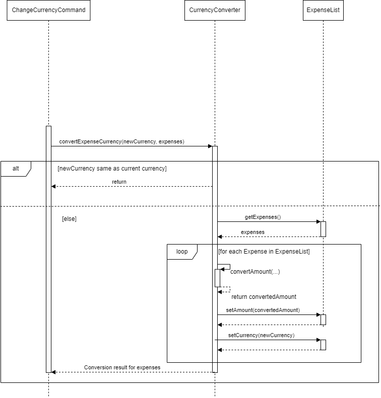

<!-- @@author sweijie24-->
Sequence Diagram for convertSavingCurrency():

<!-- @@author itsmejr257-->
Sequence Diagram for convertRecurringExpensesCurrency():
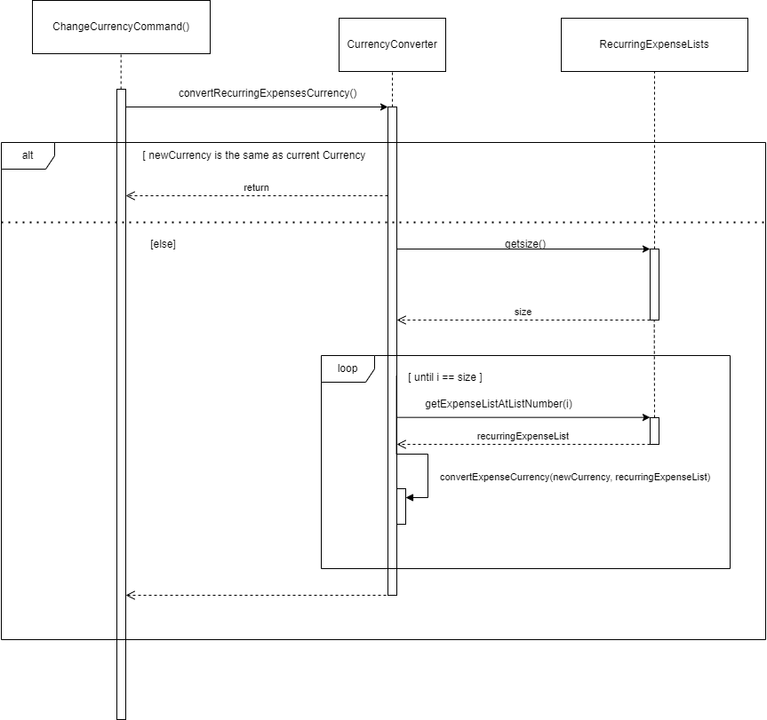

<!-- @@author yyangdaa-->
Sequence Diagram for convertSplittedExpenseCurrency():

<!-- @@author dheekshitha2-->
Sequence Diagram for convertBudgetCurrency():
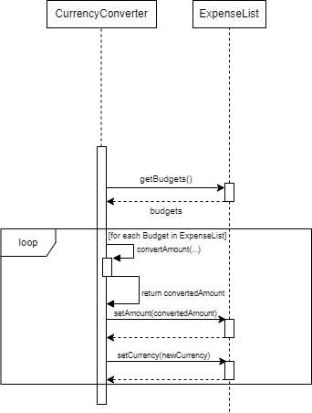

<!-- @@author itsmejr257-->
### Find Feature
The Find Feature allows users to search for expenses based on a specific criteria such as description, minimum amount
and maximum amount. This feature is orchestrated by the `FindExpensesCommand` class, which is created by the `FindExpensesCommandCreator`
, which is in turn created by the `Parser`. Within the `FindExpensesCommand` object, the `FindExpensesCommandCreator` 
would have initialized it with 4 variables, an `ExpenseList` object,  along with a `description`, `minAmount` , 
`maxAmount`. The relevance of these Class Attributes in `FindExpensesCommand` is as follows : 

| Variable Name | Variable Type | Relevance                                                                 |
|---------------|---------------|---------------------------------------------------------------------------|
| expenses      | ExpenseList   | ExpenseList Object containing the list of expenses which will be filtered |
| description   | String        | The description to match against expenses in `expenses`                   |
| minAmount     | Double        | The **minimum** amount matched expenses should be                         |
| maxAmount     | Double        | The **maximum** amount matched expenses should be                         |

Upon the call of the `execute()` method in `BudgetBuddy` using `command.execute()`,
the `FindExpensesCommand` Object, utilizes the following methods from the `ExpenseList` class in order to both 
obtain a new `ExpenseList` object containing the filtered expenses, along with printing them.

| Method           | Return Type        | Relevance                                                       |
|------------------|--------------------|-----------------------------------------------------------------|
| filterExpenses() | ArrayList<Expense> | Returns an ArrayList<Expense> containing all filtered expenses  |
| listExpenses()   | void               | Prints the filtered expenses obtained from `filterExpenses()`   |

**Important Note** : As the process of how the CommandCreator is created upon the receipt of a user input has already been
discussed in `3.4 CommandClass`, the following Sequence Diagrams would omit the initial methods prior to the
FindCommandCreator being created.

The following UML Sequence diagram below shows how FindExpensesCommandCreator works to 
obtain the relevant inputs for the FindExpensesCommand, NOTING that the Parser has already determined the input to be a find
expenses command, and has also created the FindExpensesCommandCreator.

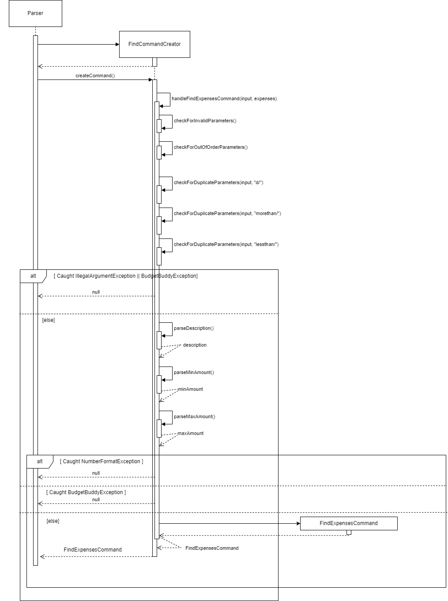

Given that multiple methods are called in `FindExpensesCommandCreator`. The following is a step-by-step explanation for the processes that occur before the FindExpensesCommand is created :
1. `BudgetBuddy` calls `Parser#parseCommand(input)` with `input` being the entire user input.
E.g `find expenses d/bruno morethan/ lessthan/`
2. Within the `Parser`, it will have determined that the `input` is a Find Command from the `isFindCommand(input)`.
3. The `Parser` then creates a `FindExpensesCommandCreator` object, initializing it with the overall Expense List and
the provided user input
4. The `Parser` then calls `FindExpensesCommandCreator#createCommand()`.
5. `FindExpensesCommandCreator#createCommand()` then calls `FindExpensesCommandCreator#handleFindExpensesCommand()`
6. Within `handleFindExpensesCommand(input)`, the first check would be the check for the existence of any combination of 
`d/ , morethan/ and lessthan/` using the method `checkForInvalidParameters()`. If none of these combinations were found, it immediately returns `null`
7. This is then followed by a second check `checkForOutOfOrderParameters()`, which checks whether `d/`, `morethan/` and `lessthan/`
is in the right order.
8. This is then followed by a third check `checkForDuplicateParameters()`, which checks for duplicates of parameters
in the user input. It duplicates are found, similarly, it immediately returns `null`.
9. If the checks in `6.` `7.` and `8.` is passed, or in this case **No Exceptions** are thrown. 
Three variables would be initialized.

    * | Variable Name | Variable Type |                                                              
      |---------------|---------------|
      | description   | String        | 
      | minAmount     | Double        |
      | maxAmount     | Double        |
10. Depending on which parameters were present, the corresponding input would be extracted from the full user input and placed into each variable
using the `FindExpensesCommandCreator#parse*()`, where `*` represents the variable name we wish to obtain.
11. Note that any parameters left empty, would be treated as **null**.
11. Should the values of `minAmount` and `maxAmount` not be empty,  a check is done to ensure `minAmount` is less than
or equals to `maxAmount`. If this check does not pass, the function immediately returns `null`
12. Finally, `FindExpensesCommandCreator#handleFindExpensesCommand()` creates and returns a 
`FindExpensesCommand` containing the extracted description, minAmount and maxAmount
13. `FindExpensesCommandCreator#createCommand()`, which is returned to, `Parser#parseCommand()`
, which is then returned to `BudgetBuddy`

The following UML Sequence diagram below shows how the Find Feature command works when a user provides a **valid**
find expenses command upon the call of its execute() method:

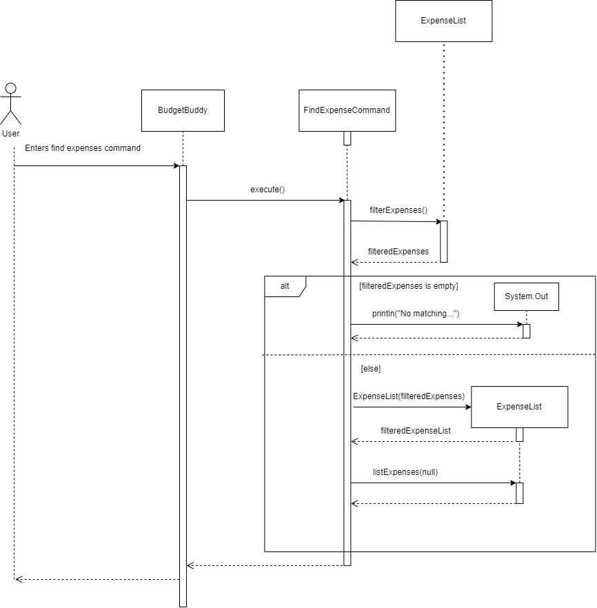

**Important Note** : Although d/ , morethan/ and lessthan/ are optional parameters, the optional component would mean
user has left that option empty if not in use, e.t.c `find expenses d/ morethan/ lessthan/200`. Hence, 
unused parameters are treated as null variables instead.

**Important Note 2** : Although the UI class is also initialized, the details of its use is omitted as its functionality in the
Find Feature is trivial. In this case, the UI class is **only** used to print dividers.

The following is an example of the processes that occur when the user uses the find expenses feature:
1. The user types `find expenses d/bruno morethan/30 lessthan/200`. This input is passed through the `Parser`
class from `BudgetBuddy`, which constructs a `FindExpenseCommandCreator` Object. The `FindExpenseCommandCreator` then
creates a `FindExpenseCommand` object with its variables initialized to `expenses : current overall ExpenseList`,
`description : bruno`, `minAmount : 30`, `maxAmount : 200`, by calling `FindExpenseCommandCreator#createCommand()`.
2. `Parser` returns this created `FindExpenseCommand` Object to `BudgetBuddy` and `BudgetBuddy` calls 
`FindExpenseCommand#execute()`
3. `execute()` is called, which initializes a variable `filteredExpenses` of type `ArrayList<Expense>`.
4. `execute()`then calls `ExpenseList#filterexpenses()`, which returns the filtered expenses based on the `description`,
`minAmount` and `maxAmount`, into the `filteredExpenses` variable.
5.  If `filteredExpenses` is empty, "No Matching Expenses Found" is printed and `execute` ends here.
6. If `filteredExpenses` is not empty, `execute()` then initializes a new variable `filteredExpenseList` 
of type `ExpenseList` with `filteredExpenses` initialized as the `expenses` Class attribute.
7. Finally `execute()` calls `filteredExpenseList#listexpenses()` to print filtered expenses into the CLI.

<!-- @@author itsmejr257-->
### Recurring Expenses Feature
The Recurring Expenses feature allows users to create list(s) of expenses, where each list can be added to
the overall expenses in a single command. This feature includes the creation of a list of expenses, the viewing of
all/each list of expenses and the removal of each list of expenses. All functions are orchestrated by the 
`RecurringExpenseCommand` class, which would have been created by the `RecurringExpenseCommandCreator`, which is in turn
created by the `Parser` class. When `RecurringExpenseCommand#execute()` is called by `BudgetBuddy`, it utilizes methods
present in `ExpenseList`, `RecurringExpenseList` and `RecurringExpenseLists` to facilitate the relevant features.

Within the RecurringExpenseCommand, the following variables would be initialized :

| Variable        | Variable Type | Relevance                                                                      |                                                           
|-----------------|---------------|--------------------------------------------------------------------------------|
| overallExpenses | ExpenseList   | Refer to the overall Expense List storing all of User's Expenses               |
| initialListName | String        | Used as the name of the new list that will be created                          |
| commandType     | String        | Type of RecurringExpenseCommand. E.g. `newlist`, `viewlists`, ...              |
| listNumber      | int           | Refers to the List Number of a recurring expense list shown during `viewlists` |
| category        | String        | Category of the Expense to be added when using `newexpense`                    |
| amount          | Double        | Amount of Expense to be added when using `newexpense`                          |
| description     | String        | Description of Expense to be added when using `newexpense`                     |

When viewing the code, you would notice that there are 5 different constructors in `RecurringExpensesCommand`. These
constructors correspond to the different `commandTypes` present. Each constructor would initialize only the required
parameters for the specified `commandTypes`.

A switch statement in `RecurringExpensesCommand` is used, where it runs the corresponding function according to the
`commandType`. The following is the `commandType`, class-level methods used and methods utilized from other classes 
when `RecurringExpensesCommand#execute()` is called

| commandType  | Calls Method                     | Uses Methods  From                                                                                               |                                                       
|--------------|----------------------------------|------------------------------------------------------------------------------------------------------------------|
| newlist      | addNewList()                     | `RecurringExpenseLists#addNewRecurringList()`                                                                    |
| viewlists    | printList()                      | `RecurringExpenseLists#printAllRecurringLists()`                                                                 |
| removelist   | removeList()                     | `RecurringExpenseLists#removeList()`                                                                             |
| newexpense   | addExpenseToList()               | `RecurringExpenseLists#getExpenseListAtListNumber()`, `ExpenseList#addExpense()`                                 |
| addrec       | addRecurringExpensesToExpenses() | `RecurringExpenseLists#getExpenseListAtListNumber()`, `ExpenseList#getExpenses()`, `AddExpenseCommand#execute()` |
| viewexpenses | printExpensesAtIndex             | `RecurringExpenseLists#getExpenseListAtListNumber()` , `ExpenseList#listExpenses()`                              |                             |

From the table above, most commandTypes have a fairly straight forward process of calling a single method from the relevant classes, and follows
a similar process to many of the previous features too. However, the `addrec` commandType would be the most complicated to follow, given that it utilizes 3 methods from three different classes. The following
is a UML sequence diagram to illustrate the implementation of the addRecurringExpensesToExpenses() method in `RecurringExpenseCommand`, upon the call of the `execute()`
from `BudgetBuddy`

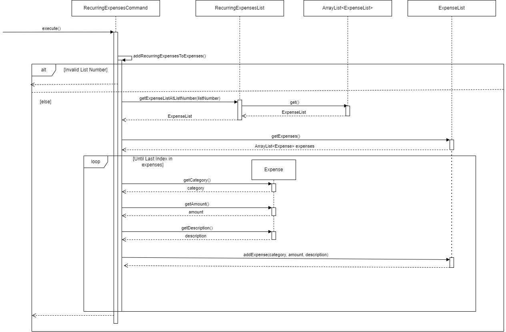

The following is an example of the processes that occur when the user uses the rec addrec command :
1. The user types `rec addrec 1`. This input is passed through the `Parser`
class from `BudgetBuddy`, which constructs a `RecurringExpenseCommandCreator`
2. `RecurringExpenseCommandCreator` identifies that the command type is `addrec`, obtains all the relevant parameters,
and uses the constructor `RecurringExpenseCommand(1, recurringExpenseLists, overallExpenses, addrec)`. Note that 
`recurringExpenseLists` here is the overall list containing all lists of recurring expenses and `overallExpenses` is the user's
overall expenses.
3. The created `RecurringExpenseCommand` is returned to the `Parser`, which is then returned to `BudgetBuddy`.
4. `BudgetBuddy` calls `RecurringExpenseCommand#execute()`
5. In `execute()`, `RecurringExpenseCommand` identifies it needs to perform a `addrec` operation from its 
`commandType` and calls its own `addRecurringExpensesToExpenses()`
6. The first check is passed as the listNumber is a valid number. If the listNumber is invalid, an error message is printed,
and the method would have ended here after printing an error message.
7. The `recurringExpenseList` we wish to add into the `overallExpenses` is obtained utilizing `RecurringExpensesList#getExpenseListAtListNumber(listNumber)`
where `listNumber` is `1`.
8. Next the `ArrayList<Expense> expenses` is extracted by utilizing `ExpenseList#getExpenses()` from our extracted `recurringExpenseList`
9. Lastly, a for loop is utilized, extracting the `category`, `amount` and `description` of all the expenses present in `expenses`
and adding them one by one into the `overallExpenses`. This is done so by creating a new `AddExpenseCommand` with the relevant parameters and executing it. FOr more details regarding
this `AddExpenseCommand`, do refer to the `Implementation` section for `AddExpenseCommand`.
10. Finally, a success message is printed to the User.

### Setting Budget Feature
The Budget Management feature allows users to set financial limits for the various categories and monitor their spending.
This feature's objective is to give users the ability to stay within their financial goals and avoid overspending.

This feature is orchestrated by `ListBudgetCommand` and `SetBudgetCommand`, which are initialised by the `Parser`
class. Below is a description of the key class attributes and methods involved in the budget setting and listing
process:

##### Class Attributes for `SetBudgetCommand`:
| Class Attribute | Variable Type | Relevance                                                           |
|-----------------|---------------|---------------------------------------------------------------------|
| expenseList     | ExpenseList   | Object containing the list of expenses to check against set budgets |
| category        | String        | The category for which the budget is being set                      |
| budget          | double        | The budget amount to be set for the category                        |

The UML Sequence diagram below illustrates the execution flow of the Set Budget Feature when a user inputs a valid
command to set a budget:
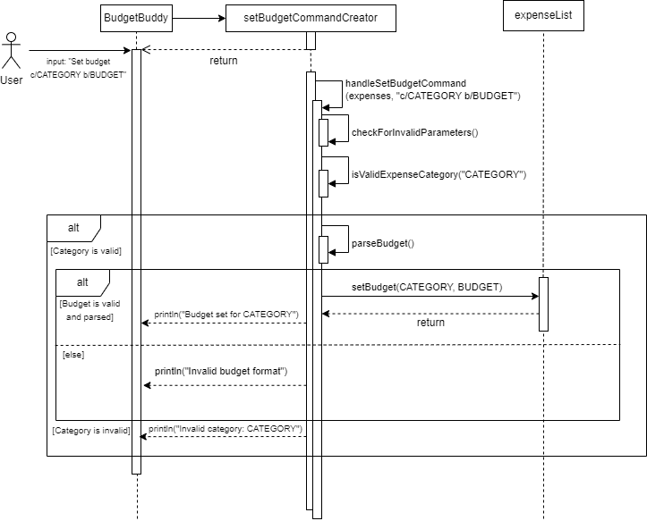

The sequence of operations for an example input, `set budget c/Transport b/500`, is as follows:
1. BudgetBuddy receives the user input and utilizes the Parser to decipher it.
2. The Parser identifies the key components of the input (category and budget) and constructs a SetBudgetCommand object with the identified category (Transport) and budget (500).
3. The Parser then hands over the SetBudgetCommand object to BudgetBuddy.
4. BudgetBuddy invokes the execute() method on the SetBudgetCommand object.
5. The SetBudgetCommand object calls the setBudget() method on the ExpenseList, passing in the category and budget amount.
6. The ExpenseList updates or creates a budget allocation for the specified category with the provided amount.
7. A confirmation message is displayed in the console indicating the budget has been successfully set or updated.

##### Class Attributes for `ListBudgetCommand`:
| Class Attribute | Variable Type | Relevance                                                           |
|-----------------|---------------|---------------------------------------------------------------------|
| expenseList     | ExpenseList   | Object containing the list of expenses to check against set budgets |

The UML Sequence diagram below illustrates the execution flow of the Set Budget Feature when a user inputs a valid
command to list budgets:
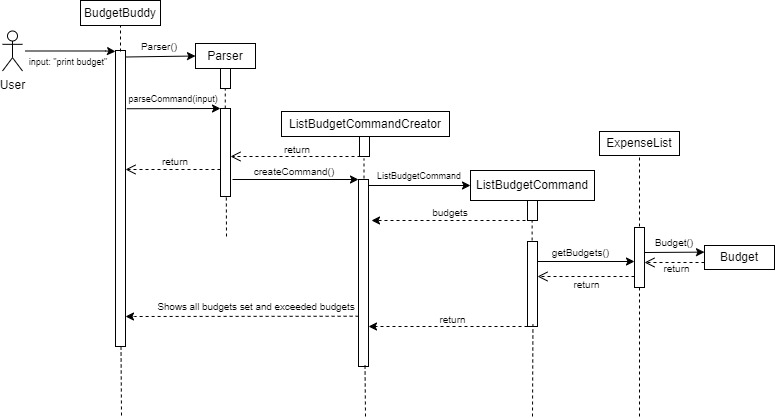

Upon the call of the `execute()` method in `BudgetBuddy` using `command.execute()`, `SetBudgetCommand` will update the
budget in `ExpenseList` using `setBudget`. Similarly, `ListBudgetCommand` will fetch and display all categories with
their budgets using `getBudgets`, and highlight those that are above the set budget.

##### Key Methods used from `ExpenseList`
| Method                      | Return Type   | Relevance                                                          |
|-----------------------------|---------------|--------------------------------------------------------------------|
| setBudget(category, budget) | void          | Sets or updates the budget for a given category in the ExpenseList |
| getBudgets()                | List<Budget>  | Retrieves the list of all budgets set                              |

The `ListBudgetCommand`'s updated execution function now features an improved display that not only shows the budget,
spent amount, and remaining balance but also clearly indicates when the budget has been exceeded. If the expenses
surpass the budget, instead of showing a negative remaining balance, it displays "Exceeded", providing a straightforward
and immediate visual cue that the budget limits have been surpassed.

The "Categories above budget" section offers a concise table summarizing which categories have gone over the budget and
by what amount, making it easy for users to identify areas of concern.

<!-- @@author jasraa-->
### 4.25 Get Expense Insights Feature

The Get Expense Insights feature allows users to analyze their spending patterns and understand where their money goes.
This feature is managed by the `GetExpenseInsightsCommand` class, which is initialized by the `Parser` class.
The `GetExpenseInsightsCommand` holds an `ExpenseList` object which contains all expenses added by the user. 
The relevance of this Class Attribute in `GetExpenseInsightsCommand` is as follows:

| Class Attribute | Variable Type | Relevance                                                            |
|-----------------|---------------|----------------------------------------------------------------------|
| expenseList     | ExpenseList   | ExpenseList object containing the list of expenses to be analyzed    |

Upon invocation of the `execute()` method in `BudgetBuddy`, the `GetExpenseInsightsCommand` leverages methods from the 
`ExpenseList` class to calculate and display spending insights.

| Method            | Return Type | Relevance                                                                                    |
|-------------------|-------------|----------------------------------------------------------------------------------------------|
| getExpenseInsights| void        | Analyzes expenses and prints insights on spending distribution, highest and lowest spending |

The following UML Sequence diagram illustrates the execution process of the Get Expenses Insights Command when a user enters a valid command:

Here's a step-by-step explanation of the processes that occur when a user invokes the Get Expense Insights feature:

1. The BudgetBuddy application receives the command `get expenses insights` and passes it to the `Parser`.
2. The `Parser` interprets the input and creates a new `GetExpenseInsightsCommand` object with the `ExpenseList`.
3. The `BudgetBuddy` application then calls `execute()` on the `GetExpenseInsightsCommand` object.
4. The `GetExpenseInsightsCommand` object calls the `getExpenseInsights` method on the `ExpenseList`.
5. The `ExpenseList` analyzes the expenses, calculating total spendings, average amount, and categorizing the expenses.
6. Insights such as the categories with the highest and lowest spending are then printed to the user.

<!-- @@author jasraa-->
### 4.26 Get Savings Insights Feature

The Get Savings Insights feature enables users to analyze their savings distribution across various categories and 
understand their saving habits. This feature is facilitated by the `GetSavingsInsightsCommand` class, which is
instantiated by the `Parser` class. In this class, a `SavingList` object is maintained, which contains all the savings
added by the user. The significance of the class attribute in `GetSavingsInsightsCommand` is as detailed below:

| Class Attribute | Variable Type | Relevance                                                           |
|-----------------|---------------|---------------------------------------------------------------------|
| savingList      | SavingList    | SavingList object containing the list of savings to be scrutinized. |

When the `execute()` method in `BudgetBuddy` is invoked via `command.execute()`, the `GetSavingsInsightsCommand` 
leverages methods from the `SavingList` class to calculate and exhibit insights about savings.

| Method               | Return Type | Relevance                                                                        |
|----------------------|-------------|----------------------------------------------------------------------------------|
| getSavingsInsights() | void        | Analyzes savings and displays insights on savings distribution, highest and lowest savings, etc. |

The following UML Sequence diagram illustrates the execution process of the Get Savings Insights Command when a user enters a valid command:

The sequential flow of execution when a user commands to get savings insights is as follows:

1. The user inputs the command 'get savings insights' and `BudgetBuddy` captures it.
2. `BudgetBuddy` employs `Parser` to decode the input.
3. `Parser` constructs a new `GetSavingsInsightsCommand` object with the `SavingList`.
4. `Parser` sends this `GetSavingsInsightsCommand` object back to `BudgetBuddy`.
5. `BudgetBuddy` calls the `execute()` method on the `GetSavingsInsightsCommand` object.
6. `GetSavingsInsightsCommand` invokes the `getSavingsInsights()` method from the `SavingList`.
7. `SavingList` computes and prints the insights, such as the categories with the highest and lowest savings and the overall distribution.
8. The insights are shown to the user.

## 5. Documentation

The following section describes how documentation for the project was written. Documentation Format follows GitHub-Flavoured Markdown.

### 5.1 Documentation Style
- We followed the style similar to the example provided [here](https://se-education.org/addressbook-level3/DeveloperGuide.html).

### 5.2 Diagrams
- We use [Draw.io](https://draw.io/) for our diagrams, exported as PNG with light theme.

### 5.3 PDF Conversion
- We use **Chrome** for converting documentations to PDF format as per recommendations [here](https://se-education.org/guides/tutorials/savingPdf.html).

## 6. Testing

The following section describes the testing methodologies followed in this project to ensure the project is of the highest standard and as bug-free as possible.

### 6.1 Running Tests
JUnit tests have been added to the project, which can be found under `src/test`. These JUnit tests aid in testing the respective commands and features against
both valid and invalid inputs. To run these tests, on `IntelliJ IDE`, simply 
`right-click` the `test` folder followed by `More Run/Debug` -> `Run Tests with Coverage`. This would run all the pre-defined tests, and also display the 
coverage for each file of the main application.

## Appendix A: Product scope

### Target user profile
This product is for users who can type fast, and wishes to handle and track their current and future
expenses on a singular platform.

### Value proposition
BudgetBuddy is faster and more efficient way to track and calculate current and future expenses if a user is able to
type fast. It also provides the ability to deal with finances on a singular platform.

## Appendix B: User Stories

## User Stories

| Version | As a ...          | I want to ...                                                   | So that I can ...                                                                             |
|---------|-------------------|-----------------------------------------------------------------|-----------------------------------------------------------------------------------------------|
| v1.0    | user              | be able to view my expenses                                     | track my prior expenditures and plan future expenses accordingly                              |
| v1.0    | user              | be able to view my savings                                      | plan my budget accordingly                                                                    |
| v1.0    | user              | be able to view my expenses by  their relevant categories       | control my spending                                                                           |
| v1.0    | user              | be able to identify my largest savings category                 | allocate necessary saved funds                                                                |
| v1.0    | user              | add expenses                                                    | track my spending                                                                             |
| v1.0    | user              | Categorise my expenses                                          | manage my finances more efficiently                                                           |
| v1.0    | user              | Edit or delete expenses                                         | remove any incorrectly added items                                                            |
| v1.0    | user              | allocate saved funds                                            | know how much I will have left after expenses                                                 |
| v1.0    | user              | be able to find expenses by description                         | know the expenses i have that is associated with the description                              |
| v1.0    | user              | be able to find expenses more than a certain amount             | know what my deemed larger expenses are                                                       |
| v1.0    | user              | be able to find expenses less than a certain amount             | know what my deemed lower expenses are                                                        |
| v1.0    | User              | See what commands i can use                                     | I know how to use the application                                                             |
| v2.0    | user              | Plan my budget                                                  | Avoid overspending                                                                            |
| v2.0    | frequent traveler | log my expenses in multiple currencies                          | accurately track my expenses across different countries                                       |
| v2.0    | user              | add multiple expenses at once                                   | Add common expenditures i have monthly at one shot                                            |
| v2.0    | user              | have multiple lists of recurring expenses                       | separate associated recurring expenses together                                               |
| v2.0    | user              | view what expenses i have in each of my recurring expenses list | know what expenses i have put into each list                                                  |
| v2.0    | user              | remove a list from my recurring expenses list                   | remove underutilized lists or wrongly added lists                                             |
| v2.0    | user              | save my expenses                                                | make sure i do not have to retype all expenses again after closing the application            |
| v2.0    | user              | load my expenses                                                | i can access previously added expenses when i reopen the application                          |
| v2.0    | user              | save my expenses in my recurring expenses                       | make sure i do not have to retype all expenses again after closing the application            |
| v2.0    | user              | load my expenses in my recurring expenses                       | i can access previously added expenses in my recurring expenses when i reopen the application |
| v2.0    | user              | view my expenses in a graphical representation                  | to analyse my highest and lowest expense categories                                           |
| v2.0    | user              | view my savings in a graphical representation                   | to analyse my highest and lowest saving categories                                            |

## Appendix C: Use Cases
(For all use cases below, the System is `BudgetBuddy` and the Actor is the `user`, unless specified otherwise).

<!-- @@author sweijie24-->
### Use Case: Listing Savings

1. User requests to list savings.
2. BudgetBuddy retrieves the stored savings and expenses.
3. BudgetBuddy calculates the remaining savings left.
4. BudgetBuddy displays the existing savings along with the initial savings amount and remaining savings left.

#### Extensions
* 1.1 User requests to list savings by a specific category.
  * 1.1.1 BudgetBuddy retrieves the stored savings and expenses.
  * 1.1.2 BudgetBuddy calculates remaining savings left.
  * 1.1.3 BudgetBuddy displays only the existing savings with the filtered category.
  * 1.1.4 BudgetBuddy displays the overall initial savings and remaining savings left.  
  Use case ends
* 1.2 The user entered an invalid category.
  * 1.2.1 BudgetBuddy shows an error message.  
  Use case ends
* 2.1 BudgetBuddy retrieves an empty savings list but existing expenses list.
  * 2.1.1 BudgetBuddy calculates savings required to pay off expenses.
  * 2.1.2 BudgetBuddy displays savings user is short of.  
  Use case ends
* 2.2 BudgetBuddy retrieves an existing savings list but an empty expenses list.
  * 2.2.1 BudgetBuddy displays all existing entries in savings list.
  * 2.2.2 BudgetBuddy still calculates remaining savings left, with 0 expenses deducted.
  * 2.2.3 BudgetBuddy displays overall initial savings and remaining savings left.  
  Use case ends
* 2.3 BudgetBuddy retrieves both empty savings and expenses list.
  * 2.3.1 BudgetBuddy displays an empty list for both savings and expenses.  
  Use case ends

<!-- @@author sweijie24-->
### Use Case: Listing Expenses

1. User requests to list expenses.
2. BudgetBuddy retrieves stored expenses.
3. BudgetBuddy calculates total overall expenses.
4. BudgetBuddy displays existing expenses along with the overall total expenses.

#### Extensions

* 1.1 User requests to list expenses by a specific category.
  * 1.1.1 BudgetBuddy retrieves stored expenses.
  * 1.1.2 BudgetBuddy calculates total overall expenses.
  * 1.1.3 BudgetBuddy displays only the existing expenses with the filtered category, along with overall total expenses.  
  Use case ends
* 1.2 User entered an invalid category.
  * 1.2.1 BudgetBuddy shows an error message.  
  Use case ends
* 2.1 BudgetBuddy retrieves an empty expense list.
  * 2.1.1 BudgetBuddy displays an empty expense list.  
  Use case ends

<!-- @@author jasraa-->
### Use Case: Edit Savings

1. User requests to edit a savings entry by specifying the index of the saving and the details to be updated.
2. BudgetBuddy prompts the user for the category, amount, and optionally, a description.
3. BudgetBuddy validates the provided index and updates the savings entry if the index is valid.
4. BudgetBuddy displays a confirmation message indicating the savings entry has been updated.

#### Extensions

* 1.1 User specifies an index that does not exist.
    * 1.1.1 BudgetBuddy displays an error message indicating the index is out of bounds.
      Use case ends.

* 1.2 User enters an invalid or non-numeric amount.
    * 1.2.1 BudgetBuddy shows an error message and prompts the user to enter a valid numerical amount.
      Use case ends.

* 1.3 User attempts to update savings with a negative amount.
    * 1.3.1 BudgetBuddy displays an error message indicating the savings amount must be positive.
      Use case ends.

<!-- @@author jasraa-->
### Use Case: Edit Expenses

1. User requests to edit an expense entry by specifying the index of the expense and the details to be updated.
2. BudgetBuddy prompts the user for the category, amount, and description for the expense.
3. BudgetBuddy checks if the expense index provided is valid.
4. If valid, BudgetBuddy updates the expense entry with the new details.
5. BudgetBuddy displays a confirmation message indicating the expense entry has been updated.

#### Extensions

* 1.1 User specifies an index that does not exist in the expense list.
    * 1.1.1 BudgetBuddy displays an error message indicating the index is out of bounds.
      Use case ends.

* 1.2 User enters an invalid or non-numeric amount for the expense.
    * 1.2.1 BudgetBuddy shows an error message and prompts the user to enter a valid numerical amount.
      Use case ends.

* 1.3 User enters a negative number for the expense amount.
    * 1.3.1 BudgetBuddy displays an error message indicating the expense amount must be positive.
      Use case ends.

<!-- @@author sweijie24-->
### Use Case: Currency Converter

1. User requests to change currency.
2. BudgetBuddy converts existing amounts in lists to new currency.
3. BudgetBuddy sets default currency to the new changed currency.
4. BudgetBuddy displays currency changed.

#### Extensions
* 1.1 User inputs an invalid currency code.
  * 1.1.1 BudgetBuddy shows an error message.  
  Use case ends
* 1.2 User inputs the same currency code.
  * 1.2.1 BudgetBuddy notifies user of the same conversion.  
  Use case ends

<!-- @@author Dheekshitha2-->
### Use Case: Delete expenses

1. User requests to delete a specific expense by specifying the index
2. BudgetBuddy retrieves the specified expense from the stored expenses list. 
3. BudgetBuddy deletes the specified expense. 
4. BudgetBuddy displays a confirmation message indicating the expense has been deleted.

#### Extensions
* 1.1 User specifies an invalid or out-of-bounds index
  * 1.1.1 BudgetBuddy shows an error message and prompts the user to enter a valid index.  
    Use case ends.
* 2.1 BudgetBuddy retrieves an empty expense list
  * 2.1.1 BudgetBuddy displays an error message indicating there are no expenses to delete.  
    Use case ends.

<!-- @@author Dheekshitha2-->
### Use Case: Reduce Savings

1. User requests to reduce savings by specifying a category and amount.
2. BudgetBuddy retrieves savings associated with the specified category.
3. BudgetBuddy reduces the savings by the specified amount.
4. BudgetBuddy displays a confirmation message indicating the savings have been reduced.

#### Extensions
* 1.1 User specifies a category not present in the savings list. 
  * 1.1.1 BudgetBuddy shows an error message indicating the category does not exist.  
  Use case ends.
* 1.2 User specifies an amount that exceeds the available savings in the category. 
  * 1.2.1 BudgetBuddy shows an error message indicating insufficient savings for the reduction.  
    Use case ends.
* 2.1 BudgetBuddy retrieves an empty savings list. 
  * 2.1.1 BudgetBuddy displays an error message indicating there are no savings to reduce.  
      Use case ends.

<!-- @@author Dheekshitha2-->
### Use Case: Listing Budget

1. User requests to list budgets. 
2. BudgetBuddy retrieves all set budgets along with their associated categories. 
3. BudgetBuddy displays each category with its corresponding budget limit. 
4. BudgetBuddy also displays the total of all budgets combined.

#### Extensions
* 2.1 BudgetBuddy retrieves an empty budget list.
    * 2.1.1 BudgetBuddy displays a message indicating no budgets have been set.  
      Use case ends.

<!-- @@author Dheekshitha2-->
### Use Case: Setting Budget

1. User requests to set a budget for a specific category by specifying the category and the budget amount. 
2. BudgetBuddy checks if the category exists; if not, it adds the category. 
3. BudgetBuddy sets or updates the budget for the specified category. 
4. BudgetBuddy displays a confirmation message indicating the budget has been set or updated.

#### Extensions
* 1.1 User specifies an invalid or non-numeric budget amount. 
  * 1.1.1 BudgetBuddy shows an error message and prompts the user to enter a valid numerical amount.  
    Use case ends.
* 1.2 User sets a budget amount to zero or a negative number. 
  * 1.2.1 BudgetBuddy shows an error message indicating the budget amount must be positive.  
      Use case ends.

<!-- @@author itsmejr257-->
### Use Case : Add a Recurring Expense List
1. User requests to add a recurring expense list with a specific name
2. BudgetBuddy creates a recurring expense list with the specified name 
   3. Use Case Ends.

#### Extensions
* 1a. Name is Empty
  * 1a1. BudgetBuddy shows an error message
    * use case ends

<!-- @@author itsmejr257-->
### Use Case : List all recurring expense lists
1. User requests to list all recurring expense lists
2. BudgetBuddy shows all lists of recurring expense list. 
   3. use case ends

#### Extensions
* 1a. The list of all recurring expense lists is empty
  * 1a1. BudgetBuddy states that no recurring expense lists has been added yet 
    * user case ends

<!-- @@author itsmejr257-->
### Use Case : Remove a recurring expense list
1. User requests to list all recurring expense lists
2. BudgetBuddy shows all lists of recurring expense list
3. User Requests to delete a specific list
4. BudgetBuddy deletes the list 
   5. use case ends

#### Extensions
* 2a. The list is empty
  * use case ends

* 3a. The given index is invalid
  * 3a.1 BudgetBuddy shows an error message
    * use case resumes at step 2

<!-- @@author itsmejr257-->
### Use Case : Add an expense to a Recurring Expense List
1. User requests to list all recurring expense lists
2. BudgetBuddy shows all lists of recurring expense list.
3. User requests to add an expense to a specific list
4. BudgetBuddy adds the expense to the list 
   5. use case ends

#### Extensions
* 2a. The list is empty
  * use case ends

* 3a. The given index is invalid 
  * 3a1. BudgetBuddy shows an error message
    * use case resumes at step 2

* 3b. The given category is invalid
  * 3b1. BudgetBuddy shows an error message
    * use case resumes at step 2  

* 3c. The given amount is invalid
  * 3c1. BudgetBuddy shows an error message
    * use case resumes at step 2  

* 3d. The given description is invalid
  * 3d1. BudgetBuddy shows an error message
    * use case resumes at step 2  

<!-- @@author itsmejr257-->
### Use Case : List all expenses in a recurring expense list
1. User requests to list all recurring expense lists
2. BudgetBuddy shows all lists of recurring expense list
3. User requests to view all expenses in a specific list
4. BudgetBuddy shows all expenses in the specific list
   5. use case ends

#### Extensions
* 2a. The list is empty
  * use case ends  

* 3a. The index is invalid
  * 3a1. BudgetBuddy shows an error message
    * use case resumes at step 2  

* 3b. The list at index is empty
  * 3b1. BudgetBuddy shows no expenses
    * use case ends  

<!-- @@author itsmejr257-->
### Use Case : Add all expenses in a recurring expense list to the overall expenses  
1. User requests to list all recurring expense lists
2. BudgetBuddy shows all lists of recurring expense list
3. User requests to add all expenses in a specific list to the overall expenses
4. BudgetBuddy adds all expenses in the specific list to the overall expenses
   5. use case ends
   
#### Extensions

* 2a. The list is empty
  * use case ends  

* 3a. The index is invalid
  * 3a1. BudgetBuddy shows an error message
    * use case resumes at step 2  

* 3b. The list at index is empty
  * 3b1. BuddyBuddy shows message stating nothing is added to overall expenses
    * use case ends  

<!-- @@author jasraa-->
### Use Case: Get Expenses Insights

1. User requests to get insights into their expenses.
2. BudgetBuddy retrieves all expenses from the ExpenseList.
3. BudgetBuddy calculates and displays insights, including highest and lowest expense categories, and categories with no expenses.
4. BudgetBuddy displays a visual representation of expense distribution across different categories.

#### Extensions

* 1.1 ExpenseList is empty.
    * 1.1.1 BudgetBuddy displays a message indicating no expense data is available to analyze.
      Use case ends.

<!-- @@author jasraa-->
### Use Case: Get Savings Insights

1. User requests to get insights into their savings.
2. BudgetBuddy retrieves all savings from the SavingList.
3. BudgetBuddy calculates and displays insights, such as highest and lowest savings categories, and categories with no savings.
4. BudgetBuddy displays a visual representation of savings distribution across different categories.

#### Extensions

* 1.1 SavingList is empty.
    * 1.1.1 BudgetBuddy displays a message indicating no savings data is available to analyze.
      Use case ends.

## Appendix D: Non-Functional Requirements

1. Should work on any *mainstream OS* as long as it has Java `11` or above installed.
2. Should be able to hold up to 1000 entries without a noticeable sluggishness in performance for typical usage.
3. A user with above average typing speed for regular English text should be able to accomplish most of the tasks faster using commands than using the mouse.

## Appendix E: Glossary

* **Mainstream OS**: Windows, Linux, macOS.
* **Recurring Expenses**: A set of expenses which can be added to the overall expenses at any given point in time
* **Overall Expenses**: Refers to the overall expense list. Etc, the expense list which expenses get added to when performing an add expense command.

## Appendix F: Instructions for manual testing

### 1. Launch and Shutdown
* 1.1 Initial Launch
  * Download the `jar` file and copy into an empty folder.
  * Navigate to the `jar` file via a Terminal/PowerShell window.
  * Start the `jar` file with the following command: `java -jar BudgetBuddy.jar`
  * Expected: Command Line Interface should launch with the Menu being shown.

### 2. Test Cases

#### 2.1 

#### 2.5 Edit Savings
**Prerequisites** : Some savings has been added to the overall savings.
1. Test Case : `edit savings c/Salary i/2 a/2000`
Expected : if there is an saving with index 2, it edits the saving at index 2. Else, an error message stating invalid index will be printed.
2. Test Case : `edit savings c/Allowance i/2 a/2000`
Expected : An error message mentioning invalid saving category will be printed.
3. Test Case : `edit savings c/Salary i/2 a/-2000`
Expected : An error message mentioning invalid amount will be printed.

#### 2.5 Edit Expenses
**Prerequisites** : Some savings has been added to the overall savings.
1. Test Case : `edit expense c/Transport i/2 a/2000 d/GRAB`
   Expected : if there is an expense with index 2, it edits the expense at index 2. Else, an error message stating invalid index will be printed.
2. Test Case : `edit expense c/MRT i/2 a/2 d/work`
   Expected : An error message mentioning invalid saving category will be printed.
3. Test Case : `edit savings c/Entertainment i/2 a/-2000`
   Expected : An error message mentioning invalid amount will be printed.

#### 2.9 Listing Savings

* 2.9.1 Listing Overall Savings
  * Prerequisites: There must be existing savings and expenses in the list.
  * Test Case: `list savings`
  * Expected: All existing savings will be printed, along with the initial amount and remaining amount after deducting expenses if necessary.

* 2.9.2 Listing Savings by a specific category
  * Prerequisites: There must be existing savings of `Salary` category and expenses in the list.
  * Test Case: `list savings Salary`
  * Expected: Savings that have the `Salary` category will be printed, along with the overall remaining savings deducting expenses.

#### 2.10 Listing Expenses

* 2.10.1 Listing Overall Expenses
  * Prerequisites: There must be existing expenses in the list.
  * Test Case: `list expenses`
  * Expected: All existing expenses will be printed, along with the overall amount.

* 2.10.2 Listing Expenses by a specific category
  * Prerequisites: there must be existing expenses of `Transport` category in the list.
  * Test Case: `list expenses Transport`
  * Expected: Expenses relating to the `Transport` category will be printed, along with the overall amount.

#### 2.21 Changing Currency

* 2.21.1 Changing Currency
  * Prerequisite: There must be existing savings and expenses in the list.
  * Test Case: `change currency USD`
  * Expected: All existing savings and expenses will be converted to the USD equivalent pricing.

* 2.21.2 Changing Default Currency
  * Prerequisite: There need not be existing savings or expenses in the list.
  * Test Case: `change currency USD`
  * Expected: Default Currency would be changed to USD. Future amounts added will be in USD.

<!-- @@author itsmejr257-->
#### 2.1 Displaying Commands
1. Test Case : `menu`    
Expected : Prints all possible menu items in the command line interface
2. Test Case : `menu 1`  
Expected : Prints all commands related to Manage Expenses` in the command line interface
3. Test Case : `menu string`  
Expected : An error message is printed in the command line interface
4. Test Case : `menu 999`  
Expected : An error message is printed in the command line interface

<!-- @@author itsmejr257-->
#### 2.13 Finding an expense
**Prerequisites** : Some expenses has been added to the overall expense.
1. Test Case : `find expenses d/cat morethan/ lessthan/`    
Expected : If there are expenses matching/containing "cat", the found expenses are printed. Else, message stating no matching expenses found is printed in command line interface
2. Test Case : `find expenses d/cat morethan/20 lessthan/`  
Expected : If there are expenses matching/containing "cat" and is more than 20, the found expenses are printed. Else, message stating no matching expenses found is printed in command line interface
3. Test Case : `find expenses d/cat morethan/string lessthan`  
Expected : An error message is printed in the command line interface

<!-- @@author itsmejr257-->
#### 2.15 Creating a new list of recurring expenses
1. Test Case : `rec newlist streaming`  
Expected : A new list created called `streaming`
2. Test Case : `rec newlist  `  
Expected : An error message will be printed in the command line interface
3. Test Case : `rec newlist |`  
Expected : An error message will be printed in the command line interface

<!-- @@author itsmejr257-->
#### 2.16 Listing all lists of recurring expenses
1. Test Case : `rec viewlists`, with already added lists    
Expected : All lists of recurring expenses will be printed in the command line interface
2. Test Case : `rec viewlists`, with no added lists  
Expected : Message stated there being no recurring expenses is printed in the command line interface
3. Test Case : `rec viewlists extra`  
Expected : `viewlists` should still work as intended, with no exceptions being thrown

<!-- @@author itsmejr257-->
#### 2.17 Removing a list of recurring expenses
1. Test Case : `rec removelist 1`, with a list being present at the list number `1` during `rec viewlists`    
Expected : List located at list number 1 will be removed, and a success message is printed in the command line interface
2. Test Case : `rec removelist string`  
Expected : Error message will be printed in the command line interface, along with the proper command format
3. Test Case : `rec removelist -1`  
Expected : Error message will be printed in the command line interface
4. Test Case : `rec removelist  `  
Expected : Error message will be printed in the command line interface

<!-- @@author itsmejr257-->
#### 2.18 Adding an expense into a list of recurring expenses
1. Test Case : `rec newexpense to/1 c/Entertainment a/200 d/description`, with a list being present at list number `1`  
Expected : Expense with details Entertainment, 200, description will be added to list at list number `1`
2. Test Case : `rec newexpense to/1`    
Expected : Error message will be printed in the command line interface
3. Test Case : `rec newexpense to/string c/Entertainment a/200 d/description`  
Expected : Error message will be printed in the command line interface

<!-- @@author itsmejr257-->
#### 2.19 Viewing all expenses in a list of recurring expenses
1. Test Case : `rec viewexpenses 1`, with a list being present at list number `1` and contains expenses inside  
Expected : Prints all expenses present in the recurring expense list 1
2. Test Case : `rec viewexpenses 1` with a list not being present  
Expected : Error message will be printed in the command line interface  
3. Test Case : `rec viewexpenses 1` with a list being present at list number `1`, but does not contain any expenses inside  
Expected : Prints an empty set of expenses to command line interface, with expenses at $0

<!-- @@author itsmejr257-->
#### 2.20 Adding all expenses in a list of recurring expenses to the overall expenses
1. Test Case : `rec addrec 1`, with a list being present at list number `1` and contains expense inside    
Expected : Adds all expenses present in recurring expense list 1 to the overall expenses
2. Test Case : `rec addrec 1`, with a list being present a list number `1` but does not contain any expenses inside  
Expected : A message is provided in the command line interface informing the user that nothing has been added
3. Test Case : `rec addrec 1`, with a list not being present at list number `1`  
Expected : Error message will be printed in the command line interface

<!-- @@author itsmejr257-->
#### Loading recurring expenses
**Prerequisite** : The `RecurringExpensesFile.txt` should be empty prior to each Test Case  
1. Test Case : Add a line in `RecurringExpensesFile.txt` called `!!! newlist !!!`
Expected : A recurring expense list named `newlist` will be present when doing a `rec viewlists`
2. Test Case : Add an invalid line in `RecurringExpensesFile.txt` called `!!! new!!!list !!!`  
Expected : Error is printed in the CLI, RecurringExpensesFile will be reset to an empty file
3. Test Case : Add a line in `RecurringExpensesFile.txt` called `!!! newlist !!!` and another line below it `1 | 2024-04-13 | Entertainment | 203.35 | movies`  
Expected : A recurring expense list named `newlist` will be present at list number 1 when doing a `rec viewlists` and an expense with the above description is present when doing a `rec viewexpenses 1`

<!-- @@author itsmejr257-->
#### Saving recurring expenses
1. Test Case : `rec newlist streaming services` followed by a `bye`  
Expected : The `RecurringExpensesFile.txt` should now contain a `!!! streaming services !!!`. The list will also still be present after Relaunching application.
2. Test Case : `rec newlist streaming services` followed by a `rec newexpense to/1 c/Entertainment a/200 d/description`, followed by a `bye`  
Expected : The recurring list `streaming services` which contains an expense with the description above will still be present after relaunching the application

<!-- @@author jasraa-->
#### 2.25 Get Graphical Insights for Expenses
* Prerequisites: There must be existing expenses in the list.
* Test Case: `get expenses insights`
* Expected: Bar graph will be printed for each category.

<!-- @@author jasraa-->
#### 2.26 Get Graphical Insights for Savings
* Prerequisites: There must be existing savings in the list.
* Test Case: `get savings insights`
* Expected: Bar graph will be printed for each category.

